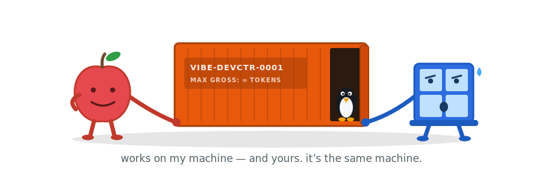

# vibe-devcontainer-submodule

<p align="center">
  
</p>

A reusable, isolated development environment for running coding agents inside your
project's toolchain on Windows + WSL2 or macOS. Claude Code by default; Codex and
Grok Build opt-in. Distributed as a **git submodule**, so every project picks up
harness improvements from one place while keeping its own thin configuration:

```text
my-project/.devcontainer/
├── devcontainer.json   # project policy (image args, mounts)
├── config.env          # project behavior toggles
├── project/            # project lifecycle hooks
└── harness/            # ← this repository, as a submodule
```

## What you get

- Coding agents in a hardened non-root container — no sudo, no Docker socket,
  no SSH/home mounts, no published ports
- Persistent agent logins per project (named volume, survives rebuilds)
- Lockfile-aware project bootstrap: uv, Bun, pnpm, npm, Yarn, Rokit, Wally
- Explicit secret loading — `.env` is never auto-sourced
- `minimal`, `python`, `bun`, and `roblox` presets

## Requirements

- Git and the Dev Container CLI (`npm install -g @devcontainers/cli`) or VS Code
  with the Dev Containers extension
- **Windows**: Docker Desktop with the WSL2 backend; keep repositories in the WSL
  filesystem (`~/dev/my-project`), not under `/mnt/c`
- **macOS**: Docker Desktop (Apple Silicon or Intel — images build natively for
  either architecture)

## Install

```bash
git clone https://github.com/chrisdruta/vibe-devcontainer-submodule.git \
  ~/dev/vibe-devcontainer-submodule

~/dev/vibe-devcontainer-submodule/install.sh --preset minimal ~/dev/my-project
```

The target must be the top level of a git repository. The installer seeds the
project-owned files, adds the submodule, and stages everything for review — commit
when satisfied. Details, options, and uninstall: [docs/installation.md](docs/installation.md).
The judgment calls (build args, lifecycle hooks, migrating an old `.devcontainer`)
can be delegated to an agent: [docs/onboarding.md](docs/onboarding.md) has the
checklist and a copy-paste prompt.

## Start coding

```bash
cd ~/dev/my-project
./.devcontainer/vibe up
./.devcontainer/vibe agent
```

Or open the repository in VS Code and choose **Reopen in Container**.

## Common commands

| Command         | Does                                                     |
| --------------- | -------------------------------------------------------- |
| `vibe up`        | Build/start the container                                 |
| `vibe agent`     | Run the default agent with explicit `.env` loading (`--cold`: no repo instruction files; `-a CMD`: pick the agent) |
| `vibe run CMD`   | Run any command with explicit `.env` loading              |
| `vibe shell`     | Open a Bash shell inside the container                    |
| `vibe clip`      | Save the host clipboard image for the container (image-paste workaround) |
| `vibe show`      | Preview an image in the terminal (default: newest `vibe clip` capture) |
| `vibe review`    | Review images interactively — navigate a watched directory, approve/reject to JSONL |
| `vibe doctor`    | Check the environment (run this first when things break)  |
| `vibe rebuild`   | Recreate after editing `devcontainer.json`/Dockerfile     |

Full list and typical workflows: [docs/usage.md](docs/usage.md).

## Presets

| Preset    | Base image                  | Adds                           |
| --------- | --------------------------- | ------------------------------ |
| `minimal` | `devcontainers/base:debian` | shell tools, Claude Code, `uv` |
| `python`  | `devcontainers/python:3.14` | Python + Ruff extensions       |
| `bun`     | `devcontainers/base:debian` | Bun, Biome extension           |
| `roblox`  | `devcontainers/python:3.14` | Rokit, Luau/Rojo extensions    |

## Customize

Edit your project's `.devcontainer/config.env` (agent command, bootstrap strictness,
required tools) and `.devcontainer/project/` hooks; enable Codex/Grok/Bun/Rokit via
build args in `devcontainer.json`. Reference: [docs/configuration.md](docs/configuration.md)
and [docs/agent-state.md](docs/agent-state.md).

## Update

Projects pin the harness to a commit; updating is an explicit, reviewable step:

```bash
git -C .devcontainer/harness fetch --tags
git -C .devcontainer/harness checkout v0.1.0
git add .devcontainer/harness && git commit -m "Update devcontainer harness to v0.1.0"
```

Branch-following convenience and caveats: [docs/updating.md](docs/updating.md) —
including a paste-ready agent prompt that moves the pin and reconciles the
project-owned files (new containerEnv keys, settings merges, wrapper changes)
for you.

## Dogfooding

This repository consumes itself: it carries its own `.devcontainer/` with the
harness as a self-submodule, so `./.devcontainer/vibe up` and `vibe agent` work
here like in any consumer. The container runs the **pinned submodule copy** at
`.devcontainer/harness`, not your working tree — to test a harness change
through the harness itself, sync the copy forward:

```bash
git commit ...                                       # your change, in the outer repo
git -C .devcontainer/harness fetch "$PWD" my-branch
git -C .devcontainer/harness checkout FETCH_HEAD
./.devcontainer/vibe rebuild   # only if Dockerfile/devcontainer.json changed
```

Never edit files under `.devcontainer/harness/` — that is the nested clone;
changes there do not land in this repository. The self-submodule is marked
`update = none` so recursive clones skip it; after a fresh clone, initialize it
explicitly with `git submodule update --init --checkout .devcontainer/harness`.

## Security

The agent can modify the mounted repository and read any credentials you deliberately
pass to it — containment reduces accidental host damage, it does not make untrusted
code harmless. The container runs non-root with all capabilities dropped and receives
no Docker socket, SSH keys, or host home.

> **Warning:** `DEV_AUTO_GIT_HOOKS` wires repo-supplied hooks into `.git/config`
> on the shared workspace mount — they also run when you use git on the host.
> Disable it before pointing the harness at third-party code.

Full threat model: [docs/security.md](docs/security.md).

## Documentation

- [Installation & uninstall](docs/installation.md)
- [Onboarding a project (agent-driven)](docs/onboarding.md)
- [Daily usage & troubleshooting](docs/usage.md)
- [Configuration reference](docs/configuration.md)
- [Agent state & multi-agent use](docs/agent-state.md)
- [Updating the harness](docs/updating.md)
- [Security model](docs/security.md)
- [Positioning & non-goals](docs/positioning.md)
- [Local models (Ollama on the host)](docs/local-models.md)
- [Roblox integration recipe](docs/roblox.md)
- [Browser automation recipe (playwright-cli)](docs/browser-automation.md)
- [Architecture & contributing](docs/architecture.md)

## License

[MIT-0](LICENSE) — copy freely, no attribution required.
