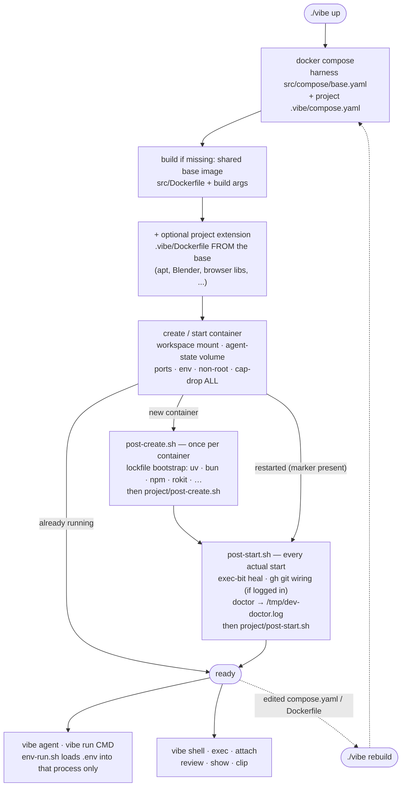
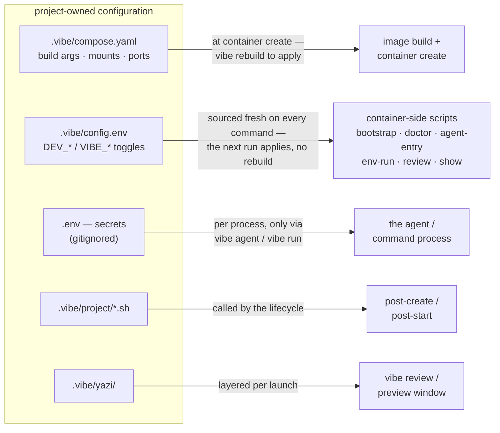

# vibe-devcontainer-submodule

<p align="center">
  
</p>

A reusable, isolated development environment for running coding agents inside your
project's toolchain on Windows + WSL2 or macOS. Claude Code by default; Codex and
Grok Build opt-in. Distributed as a **git submodule**, so every project picks up
harness improvements from one place while keeping its own thin configuration.
The engine is plain **docker compose + docker exec** driven by the `vibe`
launcher — no devcontainer CLI, no Node on the host, no VS Code required
(or involved).

```text
my-project/
├── vibe                # → .vibe/vibe (the everyday entry point)
└── .vibe/
    ├── compose.yaml    # project policy (image args, mounts, ports)
    ├── config.env      # project behavior toggles
    ├── project/        # project lifecycle hooks
    └── harness/        # ← this repository, as a submodule
```

- [What you get](#what-you-get)
- [Requirements](#requirements)
- [Install](#install)
- [Start coding](#start-coding)
- [How it works](#how-it-works)
  - [The lifecycle](#the-lifecycle)
  - [Where configuration applies](#where-configuration-applies)
- [Common commands](#common-commands)
- [Presets](#presets)
- [Update](#update)
- [Dogfooding](#dogfooding)
- [Security](#security)
- [Documentation](#documentation)

## What you get

- Coding agents in a hardened non-root container — no sudo, no Docker socket,
  no SSH/home mounts, no published ports
- Persistent agent logins per project (named volume, survives rebuilds)
- Lockfile-aware project bootstrap: uv, Bun, pnpm, npm, Yarn, Rokit, Wally
- Explicit secret loading — `.env` is never auto-sourced
- Terminal-first image tooling: clipboard hand-off (`vibe clip`), sixel
  previews (`vibe show`), batch review with verdicts (`vibe review`)
- `minimal`, `python`, `bun`, and `roblox` presets

## Requirements

- Git and Docker — that's all
- **Windows**: Docker Desktop with the WSL2 backend; keep repositories in the WSL
  filesystem (`~/dev/my-project`), not under `/mnt/c`
- **macOS**: Docker Desktop (Apple Silicon or Intel — images build natively for
  either architecture)

## Install

From the top level of your project's git repository:

```bash
git submodule add https://github.com/chrisdruta/vibe-devcontainer-submodule.git .vibe/harness
.vibe/harness/install.sh
```

On a terminal the installer interviews you (preset, optional extras like
`codex`/`playwright`, confirm); scripted use takes flags instead
(`--preset python --extras codex`). The submodule **is** the delivery
mechanism: everything arrives over git — no `curl | sh`, no npx, nothing
runs that you can't pin and diff — and the installer only seeds
project-owned files and **stages** them for your review; commit when
satisfied. Pin a specific release afterwards with `./vibe update vX.Y.Z`.

Installing many projects from one scaffold clone, all options, and
uninstall: [docs/installation.md](docs/installation.md). The judgment calls
(build args, lifecycle hooks, migrating an old setup) can be delegated to an
agent: [docs/onboarding.md](docs/onboarding.md) has the checklist and a
copy-paste prompt.

## Start coding

```bash
cd ~/dev/my-project
./vibe up
./vibe agent
```

## How it works

### The lifecycle

`vibe up` merges the harness base compose file with your project override,
lets compose build/create/start as needed, then runs the lifecycle scripts
itself — `post-create.sh` once per container, `post-start.sh` on every actual
start. A `vibe up` on an already-running, unchanged container is a fast no-op.



### Where configuration applies

The project's config splits into planes by *when* each one takes effect —
the practical difference is which changes need a rebuild (none of them
except `compose.yaml`):



`config.env` deliberately never touches the image or the container definition:
it lives on the workspace bind mount and `lib.sh` sources it at the top of
**every** container-side script run, so `vibe agent`, `vibe doctor`,
`vibe bootstrap`, `vibe review` each see the current values — edit it and the
next command picks it up. It configures *behavior*: what `vibe agent` runs
and whether it lives in tmux (`DEV_AGENT_CMD`, `DEV_AGENT_TMUX*`), bootstrap
strictness and toggles (`DEV_BOOTSTRAP_STRICT`, `DEV_AUTO_*`), what doctor
requires (`DEV_REQUIRED_COMMANDS`), which file `env-run.sh` loads
(`DEV_ENV_FILE`), and the preview/review settings (`VIBE_*`). The host
launcher itself never reads it — all consumption is container-side. Full
reference: [docs/configuration.md](docs/configuration.md).

## Common commands

| Command         | Does                                                     |
| --------------- | -------------------------------------------------------- |
| `vibe up`        | Build/start the container (runs the lifecycle hooks)      |
| `vibe agent`     | Run the default agent with explicit `.env` loading (`--cold`: no repo instruction files; `-a CMD`: pick the agent) |
| `vibe run CMD`   | Run any command with explicit `.env` loading              |
| `vibe shell`     | Open a Bash shell inside the container                    |
| `vibe clip`      | Save the host clipboard image for the container (image-paste workaround) |
| `vibe show`      | Preview an image in the terminal (default: newest `vibe clip` capture) |
| `vibe review [DIR]` | Browse/review images with yazi; `A` approves, `R` rejects (optional note) to `.review-decisions.jsonl` beside the images |
| `vibe config`    | Print the merged compose config (base + project override) |
| `vibe doctor`    | Check the environment (run this first when things break)  |
| `vibe rebuild`   | Fresh image + container after editing `compose.yaml`/Dockerfile |

Full list and typical workflows: [docs/usage.md](docs/usage.md).

## Presets

| Preset    | Base image                  | Adds                           |
| --------- | --------------------------- | ------------------------------ |
| `minimal` | `devcontainers/base:debian` | shell tools, Claude Code, `uv` |
| `python`  | `devcontainers/python:3.14` | Python toolchain               |
| `bun`     | `devcontainers/base:debian` | Bun                            |
| `roblox`  | `devcontainers/python:3.14` | Rokit                          |

Rendered previews of what each preset seeds live in
[`examples/`](examples/) — kept in lockstep with the templates by `verify.sh`.
To customize a project, edit its `.vibe/compose.yaml`, `config.env`, and
`project/` hooks ([reference](docs/configuration.md)); system-level additions
(apt packages, Blender, browser libs) go in an optional `.vibe/Dockerfile`
chained onto the shared image ([extending](docs/extending.md), worked
examples in [`examples/extensions/`](examples/extensions/)).

## Update

Projects pin the harness to a commit; updating is an explicit, reviewable step:

```bash
./vibe update    # fetch, show changelog delta + diff, checkout, stage
```

…which automates the manual flow (and `vibe update vX.Y.Z` targets or rolls
back to a specific tag):

```bash
git -C .vibe/harness fetch --tags
git -C .vibe/harness checkout v1.0.0
git add .vibe/harness && git commit -m "Update vibe harness to v1.0.0"
```

Branch-following convenience and caveats: [docs/updating.md](docs/updating.md) —
including the **migration guide from the devcontainer-engine layout**
(pre-v0.8.0 `.devcontainer/`) and a paste-ready agent prompt that moves the
pin and reconciles the project-owned files for you.

## Dogfooding

This repository consumes itself: it carries its own project config with the
harness as a self-submodule, so `./vibe up` and `vibe agent` work here like in
any consumer. The container runs the **pinned submodule copy** at
`.vibe/harness`, not your working tree — to test a harness change through the
harness itself, sync the copy forward:

```bash
git commit ...                                # your change, in the outer repo
git -C .vibe/harness fetch "$PWD" my-branch
git -C .vibe/harness checkout FETCH_HEAD
./vibe rebuild   # only if Dockerfile/compose files changed
```

Never edit files under `.vibe/harness/` — that is the nested clone; changes
there do not land in this repository. The self-submodule is marked
`update = none` so recursive clones skip it; after a fresh clone, initialize it
explicitly with `git submodule update --init --checkout .vibe/harness`.

## Security

The agent can modify the mounted repository and read any credentials you deliberately
pass to it — containment reduces accidental host damage, it does not make untrusted
code harmless. The container runs non-root with all capabilities dropped and receives
no Docker socket, SSH keys, or host home.

> **Warning:** `DEV_AUTO_GIT_HOOKS` wires repo-supplied hooks into `.git/config`
> on the shared workspace mount — they also run when you use git on the host.
> Disable it before pointing the harness at third-party code.

Full threat model: [docs/security.md](docs/security.md).

## Documentation

- [Installation & uninstall](docs/installation.md)
- [Onboarding a project (agent-driven)](docs/onboarding.md)
- [Daily usage & troubleshooting](docs/usage.md)
- [Configuration reference](docs/configuration.md)
- [Extending the image (project layers)](docs/extending.md)
- [Agent state & multi-agent use](docs/agent-state.md)
- [Updating the harness & migrating layouts](docs/updating.md)
- [Security model](docs/security.md)
- [Positioning & non-goals](docs/positioning.md)
- [Local models (Ollama on the host)](docs/local-models.md)
- [Roblox integration recipe](docs/roblox.md)
- [Browser automation recipe (playwright-cli)](docs/browser-automation.md)
- [Architecture & contributing](docs/architecture.md)

## License

[MIT-0](LICENSE) — copy freely, no attribution required.
