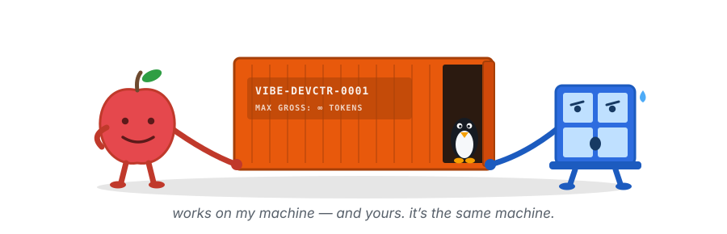

# vibe-tui-box 🥡

*Vibe coding in a box — coding agents in a hardened container, a tmux TUI on
top, one Go binary underneath.*

<p align="center">
  
</p>

`vibe` is a single compiled binary that runs coding agents (Claude Code by
default; Codex and Grok opt-in) inside a locked-down container per project,
on Windows + WSL2 or macOS. The host needs git, docker, and tmux — nothing
else. The binary embeds everything the container mounts, so installing a
release installs the whole harness.

```text
my-project/
└── .vibe/
    ├── vibe.yaml       # the entire project configuration (closed schema)
    ├── Dockerfile      # optional image extension (digest-approved)
    ├── hooks/          # post-create / post-start, run in-container
    ├── AGENTS.md       # seeded instructions teaching agents this environment
    └── requests/       # agents drop rebuild requests here
```

## Quick start

```sh
vibe init          # seed .vibe/vibe.yaml from a preset and register the project
vibe up            # freeze inputs → compile a candidate → start containers
vibe tui           # tmux session with the agent running inside
```

Day to day:

```sh
vibe status                 # container state vs the approved candidate
vibe exec -- go test ./...  # run argv in the container (explicit env only)
vibe run  -- make dev       # same, plus the project's frozen env file
vibe shell                  # interactive login shell
vibe rebuild                # recreate containers from fresh inputs
vibe down                   # stop and remove (agent state survives)
vibe doctor                 # host / project / artifact / container health
```

When an agent inside the container wants a config change applied, it writes
a request file; you decide on the host:

```sh
vibe request list           # poll + bind each request to an immutable candidate
vibe request show add-port
vibe request approve sha256:…   # applies exactly the frozen candidate you saw
```

## How it holds together

Projects author one closed `vibe.yaml` — base image, agents, toolchains,
loopback-only ports, bounded data imports, sidecar services, env file.
Unknown keys and enum values are errors; there is no raw Docker, Compose, or
shell passthrough. Every `up` freezes the inputs into a content-addressed
snapshot, compiles a canonical plan, and reconciles containers against it by
digest — identical inputs produce the identical candidate, and what you
approved is exactly what runs. Containers get a closed policy —
capabilities dropped, `no-new-privileges`, loopback-only ports, no
Docker socket, no host home; [docs/security.md](docs/security.md) is
the authoritative statement of it.

The architecture (with diagrams) is in
[docs/architecture.md](docs/architecture.md), the contributor internals in
[docs/engine-internals.md](docs/engine-internals.md); the day-to-day
docs are:

- [installation](docs/installation.md) — releases, `vibe provision`, updates
- [usage](docs/usage.md) — the full command surface
- [configuration](docs/configuration.md) — the `vibe.yaml` schema
- [extending](docs/extending.md) — project image extensions
- [security](docs/security.md) — the trust model in practice
- [positioning](docs/positioning.md) — what this deliberately is and is not

## Status

The Go engine replaced the original bash/compose harness in this tree
(that line lives in git history up to tag `v0.7.3`). There is no
migration: old installs reinstall, projects `vibe init` fresh. No release
is tagged yet — [ROADMAP.md](ROADMAP.md) lays out the path to v1.0,
[CHANGELOG.md](CHANGELOG.md) has the cutover details, and
[BACKLOG.md](BACKLOG.md) holds the unscheduled ideas.
