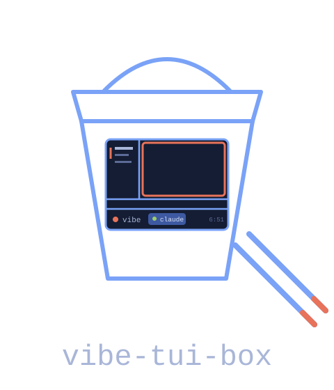

# vibe-tui-box 🥡

*Vibe coding in a box — a riced tmux TUI on a secure, isolated devcontainer chassis.*

[](https://github.com/chrisdruta/vibe-tui-box/actions/workflows/ci.yml)
[](LICENSE)

<!-- TODO(brand): swap for assets/tui.gif once recorded — assets/brand/NOTES.md has the capture recipe -->


`vibe` is a single compiled binary that runs coding agents (Claude Code by
default; Codex and Grok opt-in) inside a locked-down container per project,
on Windows + WSL2 or macOS. The host needs git, docker, and tmux — nothing
else. The binary embeds everything the container mounts, so installing a
release installs the whole harness.

- **Closed by construction.** One closed `vibe.yaml` per project — no raw
  Docker, Compose, or shell passthrough anywhere in the schema. Containers
  drop all capabilities, set `no-new-privileges`, publish ports on
  loopback only, and never see the Docker socket or your host home.
- **Deterministic by digest.** Every `up` freezes inputs into a
  content-addressed snapshot and compiles a canonical plan; identical
  inputs produce the identical candidate, and what you approved is exactly
  what runs.
- **A cockpit, not a wrapper.** A host tmux TUI keeps every project's
  agents in view with live state dots the agents' own hooks push out, and
  review happens in-container — nothing to install on the host.

## Quick start

```sh
vibe init          # seed .vibe/vibe.yaml from a preset and register the project
vibe up            # freeze inputs → compile a candidate → start containers
vibe tui           # tmux session with the agent running inside
```

Everything a project configures lives under one directory:

```text
my-project/
└── .vibe/
    ├── vibe.yaml       # the entire project configuration (closed schema)
    ├── Dockerfile      # optional image extension (digest-approved)
    ├── hooks/          # post-create / post-start, run in-container
    ├── AGENTS.md       # seeded instructions teaching agents this environment
    └── requests/       # agents drop rebuild requests here
```

## Day to day

```sh
vibe status                 # container state vs the approved candidate
vibe exec -- go test ./...  # run argv in the container (explicit env only)
vibe run  -- make dev       # same, plus the project's frozen env file
vibe shell                  # interactive login shell
vibe rebuild                # recreate containers from fresh inputs
vibe down                   # stop and remove (agent state survives)
vibe doctor                 # host / project / artifact / container health
```

When an agent inside the container wants a config change applied, it writes
a request file; you decide on the host:

```sh
vibe request list           # poll + bind each request to an immutable candidate
vibe request show add-port
vibe request approve add-port   # applies exactly the frozen candidate you saw
```

## The cockpit

`vibe tui` is a host tmux session per project — and one tab runs the
whole fleet: a sidebar that keeps every project's agents, workspace
services, and engine sidecars in view (a parked project's row is one
click from live — containers up, session open, you switched in), live
state dots the agent's own hooks push out (nothing polls), a full-width
host dock (`prefix+t`, VS Code ctrl+` feel), and a chooser for launching
whatever the image installed. Agents run in tmux *inside* the container,
so a closed terminal never kills a session. Reviewing their work needs
nothing on the host: `prefix+f` (nvim + oil) and `prefix+g` (lazygit)
open popups running in the container, pinned into the image at exact
versions. Images preview over sixel, paths ctrl+click open in nvim at
their line, and `prefix+v` carries a host clipboard image through the
boundary into the agent's prompt.

## How it holds together

Projects author one closed `vibe.yaml` — base image, agents, toolchains,
loopback-only ports, bounded data imports, sidecar services, env file.
Unknown keys and enum values are errors. Every `up` freezes the inputs
into a content-addressed snapshot, compiles a canonical plan, and
reconciles containers against it by digest. The host never executes a
byte a container could have written: workspace files are read as data
through bounded strict parsers, frozen before use, and never re-read;
agent-authored text reaches your terminal only through an encoder.
[docs/security.md](docs/security.md) is the authoritative statement of
the trust model.

## Documentation

| doc | covers |
| --- | --- |
| [architecture](docs/architecture.md) | the system as built, with diagrams |
| [engine internals](docs/engine-internals.md) | contributor deep dive, package by package |
| [installation](docs/installation.md) | releases, `vibe provision`, updates |
| [usage](docs/usage.md) | the full command surface |
| [configuration](docs/configuration.md) | the `vibe.yaml` schema |
| [extending](docs/extending.md) | project image extensions |
| [security](docs/security.md) | the trust model in practice |
| [tui layout](docs/tui-layout.md) | the cockpit's design record |

## What this deliberately is not

Agent tooling has three layers: the agent CLIs themselves (Claude Code,
Codex), the orchestrators that fan them out across worktrees, and the
environment the agent process actually executes in. `vibe` is the third
layer only — a hardened container the CLIs run inside, plus the terminal
affordances that make an agent workable there (the TUI cockpit,
clipboard through the boundary, state dots the agent's own hooks push
out). Anything that *drives* an agent is ceded to the layers above,
and that ledger is a settled scope call, not an open question: no
orchestration UI, scheduler, or fleet manager; no first-party agent
loop or model API client; no centralized credential store; no
bind-mounting host credentials (`~/.claude`, SSH keys, keychains) into
containers. Logins are per-project by design, not omission — each
project's agent-state volume is a blast-radius cell, and "log in once,
use everywhere" is exactly the cross-project token exposure the
per-project trust boundary exists to prevent.

What the refusal buys is the axis the layers above don't optimize:
trust over throughput. Not how many agents you can fan out, but knowing
exactly what each one is running in — which frozen inputs produced it,
what was approved, and what it can reach. Parallelism belongs to the
agent CLI; `vibe` hosts and surfaces it, it does not manage it.

## Status

The Go engine replaced the original bash/compose harness in this tree
(that line lives in git history up to tag `v0.7.3`). There is no
migration: old installs reinstall, projects `vibe init` fresh. No release
is tagged yet — [ROADMAP.md](ROADMAP.md) lays out the path to v1.0,
[CHANGELOG.md](CHANGELOG.md) has the cutover details, and
[BACKLOG.md](BACKLOG.md) holds the unscheduled ideas.

---

<p align="center">
  
</p>
