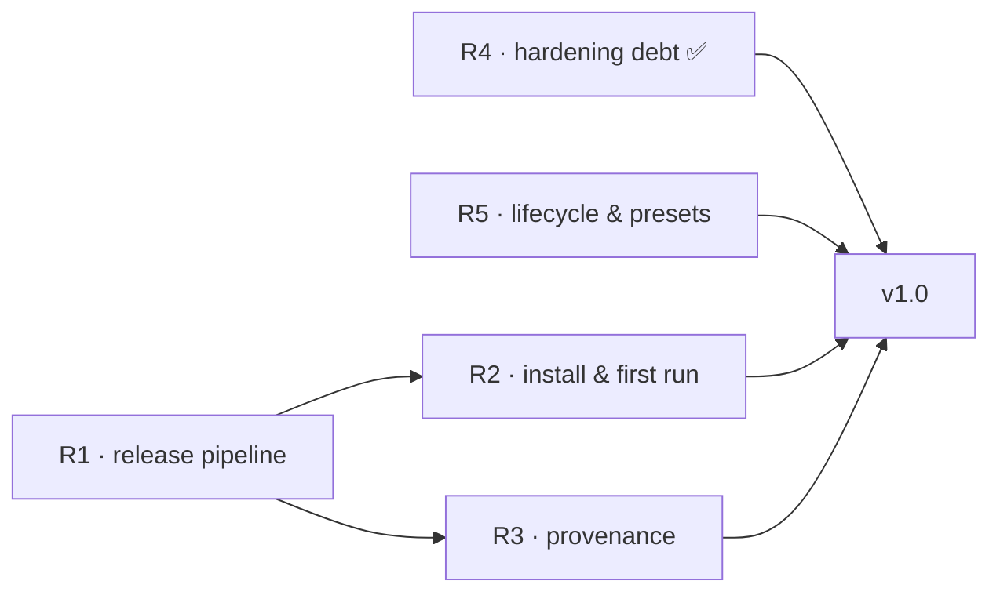

# Roadmap — to v1.0

The north star for v1.0: **a fresh machine with git, docker, and tmux goes
from release page to a coding agent in a hardened container in under two
minutes** — installable without cloning this repo, verifiable end to end,
with nothing left in the docs that the product doesn't actually do.

This file is the scheduled work. Unscheduled ideas and settled decision
records live in [BACKLOG.md](BACKLOG.md); shipped work moves to
[CHANGELOG.md](CHANGELOG.md). Items marked **(proposed)** are product
calls made while drafting this roadmap (2026-07-24) and are open to veto;
everything else consolidates debts already recorded in the architecture
docs and backlog.

## Version naming (decision, 2026-07-24)

Release tags continue the repo's own sequence: the bash line topped out at
`v0.7.3`, so the Go engine's first stable tag is **`v1.0.0`**. "v2" was
always the name of the architecture generation relative to the retired
bash harness — it stays in historical prose but is not a tag; user-facing
docs just say "the engine". The `harness: v2.0.0` strings in examples and
the dogfood manifest get reconciled when R1 settles the `harness:` field's
fate (below).

## Milestone map

R1 unblocks R2 and R3 (an installer and an attestation both need real
release artifacts to point at). R4 and R5 are independent and can proceed
in parallel at any time.

## R1 — Release pipeline: ship something installable

Everything else on this page is polish on a product nobody can install
today ("build from source, copy the binary"). First milestone is a real
tagged prerelease.

- [ ] Release build pipeline (goreleaser or equivalent): the three-platform
      matrix (`linux-amd64`, `linux-arm64`, `darwin-arm64`), `CGO_ENABLED=0`,
      archives + `checksums.txt`, version stamped into `vibe version`.
- [ ] Tag `v1.0.0-beta.1`; exercise `vibe update --version` and
      `vibe provision` against the real release assets (the code paths exist
      and are tested against fixtures; they have never seen a live release).
- [ ] Real-daemon CI for the build paths: tools-image generation, extension
      builds, and dev builds (today only `TestSDKLifecycle` meets a daemon).
- [ ] **Decide the `harness:` manifest field (proposed: remove it).** It is
      required, shape-validated, and consumed by nothing; the concept it
      encodes — which engine a project runs — already lives in the host
      registry's per-project artifact pin. Schema changes are free until the
      first release; one less concept every user has to type. If a repo-side
      version floor turns out to matter for teams, add an optional
      `min_engine:` later instead (see post-1.0).

**Exit:** a fresh machine can download a release archive by hand, run
`vibe provision`, and take a project through `init → up → tui`.

## R2 — Install story and first-run experience

v1 had `install.sh --self`; v2 has the shim-handoff code but nothing that
creates the first PATH entry. This milestone owns the funnel from release
page to first agent prompt.

- [ ] Bootstrap installer: a small, separately published installer (or
      documented one-liner) that places the binary, runs `provision`, and
      prints PATH guidance — the successor to v1's `install.sh --self`.
      Never executes a downloaded checksum file or workspace script.
- [ ] End-to-end verification on the two real platforms — WSL2 and macOS:
      project discovery, file locking, snapshotting, tmux dispatch, Docker
      endpoint selection. (The old architecture doc claimed this as a
      release gate; make it true.)
- [ ] First-contact ceremony for repos that arrive with `.vibe/` already in
      them **(proposed)**: on first `register`/`up` of a manifest this host
      has never seen, show the manifest summary and extension status before
      building — the v1 "read a third-party repo's `.vibe/` before first
      up" warning, made structural.
- [ ] Approval ergonomics **(proposed)**: `vibe request approve <request-id>`
      resolving through the host-owned pending record. The security property
      is the id→digest binding frozen at poll time in host state — making
      humans retype a 64-char digest adds friction, not safety. Keep
      `--digest sha256:…` as the explicit/scripted form.
- [ ] README / installation docs flip from "build from source" to the
      release flow.

**Exit:** the README quick start starts at a download, not `go build`, and
holds on both platforms.

## R3 — Provenance: close the supply chain

Today `checksums.txt` from the same origin is transport-integrity only; it
does not authenticate the publisher. The design (architecture.md, trust
store section) is settled; the implementation is owed.

- [ ] Native Sigstore/GitHub-attestation verification behind the existing
      `release.Verifier` seam: pinned OIDC issuer, repository, workflow
      identity, ref/tag policy, platform, and artifact digest.
- [ ] Fail closed by default — `update`, `provision`, and non-interactive
      installs refuse unverifiable artifacts; CI has no bypass.
- [ ] The interactive `--unsafe-artifact <sha256>` escape hatch: expected
      digest on the command line, unsafe provenance recorded in the project
      record and surfaced in the TUI.

**Exit:** a tampered or unattested release archive cannot become an
installed artifact without an explicit, recorded unsafe override.

## R4 — Engine hardening debt ✅ (shipped 2026-07-24)

Known gaps in the shipped engine, independent of the release work.

- [x] Store garbage collection: `vibe gc [--dry-run] [--min-age]` —
      lease-respecting, never removes a registry-pinned artifact, an
      approved or pending-bound candidate, their snapshots, or anything
      younger than the age floor; also collects stale staging, superseded
      binary copies, and forgotten projects' broker/approval/dev state.
- [x] Fuzz targets in CI: schema/YAML inspection, envfile parser, ID and
      digest parsers, request JSON, terminal encoder + diff. (The first
      fuzz run found and fixed a width-underflow crash in the diff
      renderer; the crasher is a committed regression seed.)
- [x] Bounded plan diff in approval prompts — `request show` and the
      approve confirmation render the engine's own diff of the approved →
      pending canonical plans, sanitized and bounded, beside the agent's
      untrusted summary.

**Exit met:** `~/.vibe` can't grow without bound, hostile-input surfaces
have fuzz coverage, and approvals show a trusted diff.

## R5 — Payload lifecycle and presets

The container side is behind the engine: the entrypoint marks ready and
idles, and only the `minimal` preset ships.

- [ ] Project lifecycle hooks: post-create / post-start (payload-side,
      workload-trust like the rest of the workspace), plus the in-container
      services session they stand up; `agent-session.sh attach` mode joins
      it (deferred from agent-session slice 3).
- [ ] Presets beyond `minimal` **(proposed: node, bun, go — nearly free,
      the toolchain recipes already exist)**; the playwright extension
      example; an AGENTS.md template teaching agents the broker protocol;
      hook templates once hooks land.
- [ ] `vibe logs [SERVICE]` **(proposed, small)**: container/sidecar logs
      without raw docker incantations — same rationale that earned `status`
      and `down` their seats in v1.

**Exit:** a preset-initialized project can stand up a dev server on start
and attach to it; "add Playwright to this project" typed at the agent
produces an approval prompt and a rebuilt container (the original v1.0
story from the port plan).

## The v1.0 gate

- [ ] R1–R5 shipped, or consciously cut with the reason recorded in
      BACKLOG.md.
- [ ] Docs pass: installation/usage/configuration reconciled against the
      released behavior; residual risks reviewed against
      [docs/architecture.md](docs/architecture.md).
- [ ] Tag `v1.0.0`.

## Deliberately after v1.0

Demand-gated work, detailed in [BACKLOG.md](BACKLOG.md): the reduced-trust
`vibe agent --jailed` profile, per-project egress visibility, worktree
productization, the review/image stack revival (yazi review, sixel
pipeline, revdiff verdict), event-driven sidebar refresh, and a repo-side
minimum-engine-version floor for teams if real multi-machine use asks for
it.
