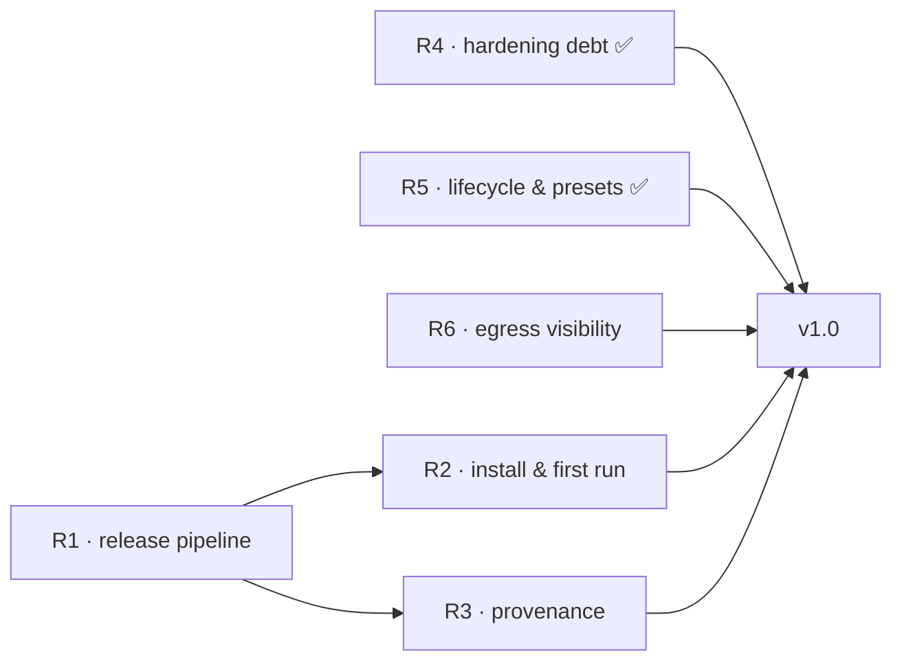

# Roadmap — to v1.0

**The thesis (restated 2026-07-26, Chris).** vibe-tui-box is a personal
instrument, deliberately opinionated to its author's view of safe, fast
agentic coding — not a distribution play. v1.0 is therefore a **trust
gate, not a funnel gate**: the author leaves dev mode onto a pinned
release (`vibe dev off` literally requires a release artifact to hand
the shim back to), lives in vibe daily on real projects, and drops this
repo to reactive maintenance. Being the only user is fine; friends
trying it someday is demand-gated polish, not the bar.

The operational north star stays useful as a quality floor: **a fresh
machine with git, docker, and tmux goes from release archive to a coding
agent in a hardened container in minutes** — verifiable end to end, with
nothing left in the docs that the product doesn't actually do.

This file is the scheduled work. Unscheduled ideas and settled decision
records live in [BACKLOG.md](BACKLOG.md); shipped work moves to
[CHANGELOG.md](CHANGELOG.md). Items marked **(proposed)** are product
calls made while drafting this roadmap (2026-07-24) and are open to veto;
everything else consolidates debts already recorded in the architecture
docs and backlog.

## Version naming (decision, 2026-07-24)

Release tags continue the repo's own sequence: the bash line topped out at
`v0.7.3`, so the Go engine's first stable tag is **`v1.0.0`**. "v2" was
always the name of the architecture generation relative to the retired
bash harness — it stays in historical prose but is not a tag; user-facing
docs just say "the engine". (The `harness:` manifest field itself was
removed 2026-07-28 — see the settled R1 item below.)

## Milestone map

R1 unblocks R2 and R3 (an installer and an attestation both need real
release artifacts to point at). R4 and R5 shipped; R6 is independent of
the release chain and can proceed at any time.

**Current sequencing (2026-07-28, Chris).** This supersedes the
2026-07-26 declaration that R1 was the main thread with TUI work
"dogfood-reactive only" — a claim the two days that followed
contradicted with 28 commits of new TUI capability and zero release
work. Recording what is actually true rather than re-declaring what
wasn't: **the TUI/DevX instrument is the main thread.** R1 is
unchanged in content and remains the gate to v1.0, but it is
demand-gated like everything else under the thesis — it gets scheduled
when the author actually wants to leave dev mode onto a pinned
release, not asserted as "next" while the instrument work continues.
Corollary: this file stops pre-scheduling TUI arcs; that work ships as
it ships and the CHANGELOG records it. An arc written here on the day
its commits land is unscheduled work, and this file won't pretend
otherwise.

## R1 — Release pipeline: ship something installable

Everything else on this page is polish on a product nobody can install
today ("build from source, copy the binary"). First milestone is a real
tagged prerelease.

- [ ] Release build pipeline (goreleaser or equivalent): the three-platform
      matrix (`linux-amd64`, `linux-arm64`, `darwin-arm64`), `CGO_ENABLED=0`,
      archives + `checksums.txt`, version stamped into `vibe version`.
- [ ] Tag `v1.0.0-beta.1`; exercise `vibe update --version` and
      `vibe provision` against the real release assets (the code paths exist
      and are tested against fixtures; they have never seen a live release).
- [ ] Real-daemon CI for the build paths: tools-image generation, extension
      builds, and dev builds (today only `TestSDKLifecycle` meets a daemon).
- [x] **Decide the `harness:` manifest field — REMOVED (2026-07-28).** It
      was required, shape-validated, and consumed by nothing; the concept
      it encodes — which engine a project runs — already lives in the host
      registry's per-project artifact pin. Removed from the schema,
      presets, and dogfood manifest while schema changes were still free;
      old manifests fail the unknown-key check with a one-line fix. If a
      repo-side version floor turns out to matter for teams, an optional
      `min_engine:` can be added later instead (see post-1.0).

**Exit:** a fresh machine can download a release archive by hand, run
`vibe provision`, and take a project through `init → up → tui`.

## R2 — Daily-driver readiness (recut 2026-07-26 for the thesis)

Was "install story and first-run experience"; under the trust-gate
thesis it splits into what the author's daily use needs (the gate) and
what a first friend would need (demand-gated, moved below).

**Gate items:**

- [ ] End-to-end verification on the author's real platform — WSL2
      (macOS joins if/when a second platform becomes real): project
      discovery, file locking, snapshotting, tmux dispatch, Docker
      endpoint selection, `update`/`provision` against live releases.
      Measure the first-build wall clock honestly: `vibe up` now also
      builds the review-stack layers (nvim/lazygit/plugins/parser
      compile, 2026-07-26) — if it misses "minutes", rescope the
      promise, don't quietly miss it.
- [x] Approval ergonomics (shipped 2026-07-28): `vibe request approve
      <request-id>` resolving through the host-owned pending record. The
      security property is the id→digest binding frozen at poll time in
      host state — making humans retype a 64-char digest added friction,
      not safety. `--digest sha256:…` remains the explicit/scripted form.
- [ ] First-contact ceremony for repos that arrive with `.vibe/` already in
      them **(proposed)**: on first `register`/`up` of a manifest this host
      has never seen, show the manifest summary and extension status before
      building. Kept in the gate — it protects the author cloning a
      stranger's repo, not just friends.

**Friend-gated (first outside user asks; recorded here, not owed):**
the bootstrap installer / one-liner (successor to v1's
`install.sh --self`; never executes a downloaded checksum file or
workspace script), and the README/installation flip from "build from
source" to the release flow.

**Exit:** the author's daily loop — morning `vibe tui`, real work,
approvals, evening park — runs entirely on released artifacts on WSL2.

## R3 — Provenance: close the supply chain (slimmed 2026-07-26)

Today `checksums.txt` from the same origin is transport-integrity only; it
does not authenticate the publisher. The design (architecture.md, trust
store section) is settled. Under the trust-gate thesis the scope slims:
the publisher and the sole consumer are the same person, so full
Sigstore verification defends mainly against a GitHub-account/CI
compromise — real, but not the v1 gate. **v1 ships with checksums +
tag discipline; the items below activate on the first second machine
or first friend** (consciously-cut-with-reason, per the gate rule).

- [ ] Native Sigstore/GitHub-attestation verification behind the existing
      `release.Verifier` seam: pinned OIDC issuer, repository, workflow
      identity, ref/tag policy, platform, and artifact digest.
- [ ] Fail closed by default — `update`, `provision`, and non-interactive
      installs refuse unverifiable artifacts; CI has no bypass.
- [ ] The interactive `--unsafe-artifact <sha256>` escape hatch: expected
      digest on the command line, unsafe provenance recorded in the project
      record and surfaced in the TUI.

**Exit:** a tampered or unattested release archive cannot become an
installed artifact without an explicit, recorded unsafe override.

## R4 — Engine hardening debt ✅ (shipped 2026-07-24)

Known gaps in the shipped engine, independent of the release work.

- [x] Store garbage collection: `vibe gc [--dry-run] [--min-age]` —
      lease-respecting, never removes a registry-pinned artifact, an
      approved or pending-bound candidate, their snapshots, or anything
      younger than the age floor; also collects stale staging, superseded
      binary copies, and forgotten projects' broker/approval/dev state.
- [x] Fuzz targets in CI: schema/YAML inspection, envfile parser, ID and
      digest parsers, request JSON, terminal encoder + diff. (The first
      fuzz run found and fixed a width-underflow crash in the diff
      renderer; the crasher is a committed regression seed.)
- [x] Bounded plan diff in approval prompts — `request show` and the
      approve confirmation render the engine's own diff of the approved →
      pending canonical plans, sanitized and bounded, beside the agent's
      untrusted summary.

**Exit met:** `~/.vibe` can't grow without bound, hostile-input surfaces
have fuzz coverage, and approvals show a trusted diff.

## R5 — Payload lifecycle and presets ✅ (shipped 2026-07-24)

The container side was behind the engine: the entrypoint marked ready
and idled, and only the `minimal` preset shipped.

- [x] Project lifecycle hooks: `.vibe/hooks/post-create.sh` (once per
      container, marker-guarded and self-healing) and `post-start.sh`
      (after every actual start), executed in-container by the engine
      after reconcile — workload trust, no env file, failure fails `up`.
      The `services` inner tmux session rides the same server via the
      idempotent `svc.sh` helper; `vibe attach [SESSION]` (and
      `agent-session.sh attach`, deferred from agent-session slice 3)
      joins it.
- [x] Presets beyond `minimal`: `go`, `node`, `bun`, and the `playwright`
      extension example (digest-approved Dockerfile + browser-install hook
      sample); a shared overlay seeds `.vibe/AGENTS.md` (teaching agents
      the environment and the broker protocol) and inert hook samples into
      every preset. All presets render and validate in tests against the
      real schema and Dockerfile contract.
- [x] `vibe logs [SERVICE] [-f] [--tail N]`: container/sidecar logs
      without raw docker incantations — same rationale that earned
      `status` and `down` their seats in v1.

**Exit met:** a preset-initialized project can stand up a dev server on
start and attach to it; "add Playwright to this project" typed at the
agent produces an approval prompt (with a trusted plan diff) and a
rebuilt container — the original v1.0 story from the port plan.

## R6 — Per-project egress visibility ✅ (shipped 2026-07-31)

Graduated from the backlog during the 2026-07-31 cleanup pass: the last
big capability wanted before the v1.0 cut (Chris). A per-project VIEW of
what the container talks to — visibility first, enforcement later; the
guardrail-not-jail philosophy applied to the one surface security.md
admits is wide open.

Implemented 2026-07-31 (digest-pinned CoreDNS sidecar, runtime-resolved
resolver + `dev.vibe.dns` drift label, pure-/proc sampler, palette
"network egress" → hidden `_egress` porcelain, `runtime.egress: off`
opt-out); live dogfood proof passed the same day: curl-from-dev lands
in `vibe logs dns`, alias lookups still resolve through the embedded
DNS, the popup renders both sections, and a stop/up round-trip keeps
dev's resolver matching the sidecar's live address. One live-found
correction: the CoreDNS binary's file capabilities EPERM at exec under
the closed policy, so the sidecar runs as root with exactly
NET_BIND_SERVICE re-granted (the one policy exception — BACKLOG
decision record).

- [x] An engine-generated DNS-forwarder sidecar in the project plan
      whose query log IS the project's domain ledger — name-level, no
      MITM, no proxy env vars for tools to ignore.
- [x] An in-container live-socket sampler (proc-net, works
      unprivileged — no `ss` dependency, uid-1000 attribution only;
      packet capture is off the table by design —
      cap_drop ALL removes NET_RAW) attributing current connections to
      processes.
- [x] Surfaced in the tui — palette window / `vibe exec` trial first
      (palette item + prefix+E, no tray cell), not a top-level verb
      until it earns harness logic (command surface is ABI).

Accepted blind spots: direct-to-IP and DoH skip the DNS log (the
sampler still shows those IPs). Upgrade path: the sidecar seat is
exactly where an L7 allowlist proxy would sit (2026-07 research:
dynamic allowlists > static iptables) — that enforcement half stays
post-v1.0, consumed by `--jailed`'s network posture.

**Exit met:** the tui can show, per project, the domains the container
has resolved and the live connections attributed to processes.

## The v1.0 gate

- [ ] R1–R6 shipped, or consciously cut with the reason recorded in
      BACKLOG.md (R3 is pre-cut to checksums, above).
- [ ] **The trust proof: a second, real, non-vibe project** registered
      and worked daily through the engine for a sustained stretch
      without needing engine edits. All dogfood to date is
      self-hosting — vibe developing vibe — which exercises dev mode,
      not the life the thesis describes. Leaving dev mode (`vibe dev
      off` onto the beta release) is part of this proof.
- [x] Codex sandbox seeder + plugin patch defects fixed (2026-07-26):
      the presence check accepts indented `sandbox_mode` (no more
      duplicate-key brick), the plugin rewrite is scoped to the
      openai-codex marketplace tree, and Go fixtures drive both shell
      functions (`internal/payload/agentplugins_test.go`).
- [ ] Docs pass: installation/usage/configuration reconciled against the
      released behavior; residual risks reviewed against
      [docs/architecture.md](docs/architecture.md).
- [ ] Tag `v1.0.0`.

## Maintenance posture after v1.0

"Stopping all focus" is viable because the system is built to rot
slowly: agent CLIs float by design (channel installers + the
`--refresh-agents` cache-buster; manifest pins for the deliberate),
while the container world is hermetic — engine-pinned tmux/nvim/
lazygit/plugin SHAs/parsers neither update themselves nor reach the
network at runtime. The realistic rot vector is upstream agent CLIs
changing their hook/statusline/plugin contracts, which arrives via an
agent refresh and gets fixed reactively (the codex-plugin sed patch in
the BACKLOG is the standing example). No bump cadence is scheduled;
pins move when something breaks or a deliberate refresh is wanted.

## Deliberately after v1.0

Demand-gated work, detailed in [BACKLOG.md](BACKLOG.md): the reduced-trust
`vibe agent --jailed` profile (consuming R6's egress-enforcement
half), worktree
productization (the review stack is fully resolved — viewing shipped
2026-07-26, images 2026-07-27, A/R verdict capture dropped and the
revdiff trial retired by decision), plus event-driven
sidebar refresh, and a repo-side minimum-engine-version floor for teams
if real multi-machine use asks for it. Plus the friend-gated
distribution items recorded in R2 (bootstrap installer, README flip)
and R3's full Sigstore verification — all triggered by the first
outside user or second machine, not by the calendar.
