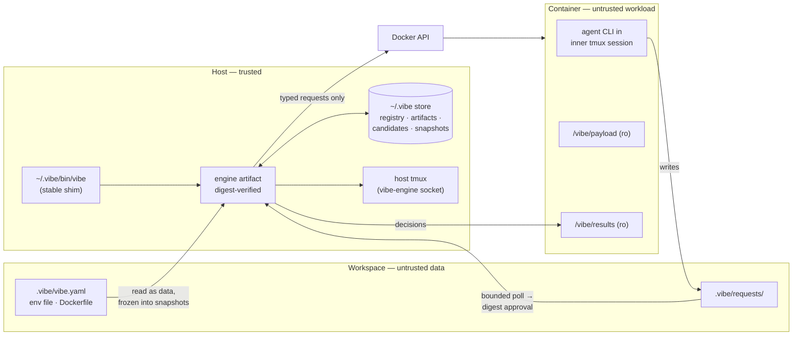
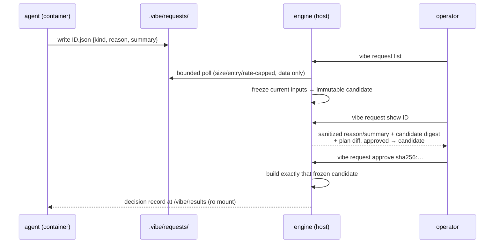
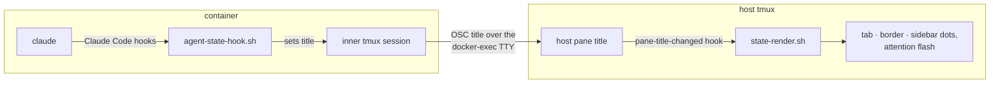

# Architecture — the Go engine

As-built reference for the v2 engine (cutover 2026-07-23; agent session
layer 2026-07-24). Contributor-facing internals:
[engine-internals.md](engine-internals.md). What is still owed before the
first tagged release: [../ROADMAP.md](../ROADMAP.md). Design history —
how this architecture was arrived at — is recorded at the
[bottom](#design-history).

## Premise and boundary

v2 was a rewrite of the v1 bash/compose harness, not a port. There is no
migration surface: nothing recognizes the v1 submodule layout,
`.devcontainer`, k=v records, or the bash host layer.

The product is a tmux TUI over hardened per-project containers. The
container reduces accidental host damage; it does not make untrusted
project code safe. The host boundary is:

> The host executes only attested, digest-identified engine artifacts from
> host-owned immutable state. Workspace bytes are never executed, sourced, or
> evaluated by a host process. They reach Docker only as either:
>
> 1. values in a canonical, capability-bounded typed model produced by the
>    trusted engine; or
> 2. a separately identified, immutable input whose exact digest a human has
>    explicitly trusted for that operation.

The first category covers ordinary `vibe.yaml` changes. The schema can
express container data — environment values, loopback ports, images,
copied data imports — but cannot express Docker capabilities or raw
Compose. The second category covers an extension Dockerfile: Docker
executes its instructions, so the user approves its exact frozen digest
separately.

Dev mode is a third, deliberately weaker boundary. It compiles
workspace-derived Go source into a host executable and therefore disables
the host-code provenance guarantee for that project. Entering or
synchronizing dev mode is a separate, explicit source-trust ceremony; an
environment rebuild request can never trigger it.

## System overview



One release produces one artifact per supported platform: `linux-amd64`,
`linux-arm64`, and `darwin-arm64`. Each binary embeds the container
payload and project presets, so installing a release installs the whole
harness — there is no submodule, mirror, or separate payload download.

The engine drives the Docker API directly, never Docker Compose. That
removes Compose's second interpolation/parser phase and its implicit
`.env`, `COMPOSE_*`, include, and provider surfaces. `vibe config` prints
the canonical typed model as JSON; it is diagnostic output, not an
executable Compose file.

## Project surface

Projects author one closed, versioned `.vibe/vibe.yaml` — base image,
agents, toolchains, loopback ports, bounded data imports, sidecar
services, env file (full schema: [configuration.md](configuration.md)).
Unknown keys and enum values are errors. There is no raw Docker, Compose,
BuildKit, tmux, shell, or command passthrough.

The manifest parser is deliberately bounded: valid UTF-8 YAML only, one
document, size/depth/node/entry/scalar limits, and rejection of aliases,
anchors, merge keys, custom tags, duplicate keys, non-string mapping
keys, NUL, and disallowed control characters. It parses into `yaml.Node`,
validates the node graph, then decodes with `KnownFields(true)` —
structural inspection before typed decode, position-aware diagnostics
after (limits and pipeline: [engine-internals.md](engine-internals.md)).

## Inputs, snapshots, and candidates

Every Docker-facing operation runs from frozen inputs, never live
workspace files:

```mermaid
flowchart LR
    inputs["vibe.yaml · env file ·<br>imports · Dockerfile"]
    snap["input snapshot<br>(sha256 tree digest)"]
    plan["canonical plan<br>(deterministic JSON)"]
    cand["candidate<br>(sha256 digest)"]
    ctrs["containers<br>(label-reconciled)"]
    appr["approved-candidate<br>pointer"]

    inputs -->|"freeze: FD-relative walk,<br>symlink-rejecting, bounded"| snap
    snap -->|"compile + resolve<br>image digests"| plan
    plan --> cand
    cand -->|reconcile| ctrs
    ctrs -->|"only after<br>containers run"| appr
```



- **Snapshot.** A git-free, FD-relative filesystem walker (`os.Root`)
  copies an explicit allowlist of workspace inputs into host-owned
  staging: symlinks, hardlinks, and special files rejected, identity
  re-checked after copy, file count and bytes capped, then fsync and one
  atomic rename into the immutable store. Import sources are copied here
  too — imports mount the frozen copy, never a live workspace subpath.
- **Plan.** `model.Compile` turns manifest + snapshot + resolved image
  digests into the canonical plan: containers, mounts, ports, volumes,
  networks, labels, policy. Canonical JSON field order and sorted
  collections make identical inputs produce the identical digest; the
  compile is golden-tested.
- **Candidate.** Plan + snapshot + resolved digests published together
  under one content digest. Approval, reconciliation, and broker
  decisions all address this digest — never a workspace path.
- **Reconcile.** Containers carry `dev.vibe.*` labels; `up` compares live
  Docker state against the candidate by label and normalized spec,
  replaces only what it decided to replace, and refuses name-colliding
  containers it does not manage. `up` is idempotent; a failed `up` never
  moves the approved-candidate pointer.
- **Lifecycle hooks.** After reconcile, the engine execs the payload's
  lifecycle runner in the dev container: `.vibe/hooks/post-create.sh`
  once per container (marker-guarded in the container, so a failed
  first run self-heals), `.vibe/hooks/post-start.sh` after each actual
  create or start. Hooks are workspace files — workload trust, executed
  in-container only — and a failing hook fails the `up` before the
  approved pointer moves.

## Container policy

Every managed container, sidecars included, gets a closed policy:

- runs as the image's `vscode` user; extension images must end as it;
- all capabilities dropped, `no-new-privileges` set;
- privileged mode, added capabilities, devices, host namespaces, Docker
  sockets, SSH and host-secret mounts are not schema concepts;
- published ports bind loopback only;
- the only live host bind is the exact registered project root at
  `/workspace` — never a subpath, never another host path;
- engine-owned mounts (`/vibe/payload` ro, `/vibe/agent-state`,
  `/vibe/results` ro) are generated and target-checked; custom import
  targets must be absolute, normalized, unique, and may not equal,
  contain, or be contained by an engine-owned target;
- named volumes are engine-named from the project ID; external names and
  cross-project volume references cannot be expressed.

Environment values are opaque container data: assigned through Docker API
fields, never merged into a host process environment, never logged, never
part of the plan digest. The env file is parsed literally — no shell
syntax, no interpolation — and frozen into the snapshot.

## Extension builds

An optional `.vibe/Dockerfile` (`image.extension: true`) is outside the
capability-bounded manifest lane: it is workload code Docker will
execute. Enabling or changing it produces a build candidate — Dockerfile
plus a restricted context (`.vibe/build/` only; never the env file or
manifest) — whose digest the operator must approve before the engine
submits the build. Approval is per changed digest, not standing trust in
a path. The validator rejects custom `# syntax` frontends, any `FROM`
other than the engine-supplied digest-pinned base, multi-stage builds,
`ADD`, `ONBUILD`, and a final user other than `vscode`
([extending.md](extending.md)).

`image.agents` / `image.toolchains` are the approval-free counterpart:
the engine generates an install Dockerfile from its own closed recipe set
and bakes a per-project tools image on the pinned base. No project bytes
enter that build — the manifest only selects recipes — so there is
nothing to approve.

## Trust store and distribution

The immutable identity of executable code is an artifact SHA-256 digest —
never a tag, version string, path, or source hash.

```text
~/.vibe/                              # 0700, host-owned
├── bin/                              # engine binaries; `vibe` symlink = current
├── artifacts/<sha256>/               # immutable engine + payload by digest
└── state/
    ├── projects/<project-id>.json    # registry: root identity, artifact pin,
    │                                 #   approved candidate (CAS revisions)
    ├── candidates/<digest>/          # immutable plans + metadata
    ├── snapshots/<digest>/           # immutable frozen inputs
    ├── broker/<project-id>/          # request decisions (host-owned)
    ├── locks/                        # advisory flocks (fixed order)
    └── staging/                      # same-filesystem atomic-rename staging
```

Artifacts are published by staging → fsync → atomic rename and never
mutated; an existing digest directory is never replaced. Shared-flock
leases keep an artifact or candidate alive while in use; persistent
records are versioned JSON decoded with `DisallowUnknownFields`.
Collection is explicit and only explicit: `vibe gc` removes objects no
registry pin, approved-candidate pointer, or pending broker binding
references — refusing live leases (the exclusive flock loses to any
shared one) and anything younger than its age floor — plus stale
staging, superseded binary copies, and forgotten projects' broker/state
leftovers.

Release acquisition (`vibe update`) streams the archive while hashing,
verifies against the release's `checksums.txt`, extracts only known entry
types, validates the embedded payload manifest file-by-file, and
publishes by digest. `vibe provision` installs the currently running
binary the same way. **Checksums are transport-integrity only** — native
Sigstore/GitHub provenance verification (fail-closed, pinned issuer /
repo / workflow identity) is designed but not yet implemented; it is a
release blocker tracked in [../ROADMAP.md](../ROADMAP.md).

Project identity: discovery walks upward from a physical canonical cwd
(no git involved); registration records the canonical root plus platform
file identity and assigns a random project ID. Display names never
participate in trust lookup.

Host subprocesses are rare — the Docker API replaces the docker/compose
CLIs — but tmux runs by absolute prevalidated path with a fixed minimal
environment (trusted PATH, explicit locale/home; no `LD_*`, `GIT_*`,
`DOCKER_*`, `TMUX_TMPDIR`, or project values), argv only, never a shell
string.

## Dev mode

Dev mode exists only for developing this harness and does not preserve
the host-code provenance boundary. `vibe dev on`/`sync` snapshots an
explicit source allowlist (`build/dev-sources.txt`) with the same
snapshotter, requires a distinct confirmation that the result will
execute on the host, builds in a digest-pinned golang builder container,
records full provenance (source Merkle root, builder digest, dependency
state, output digest), stamps the binary `dev-src-<digest12>`, and
repoints `~/.vibe/bin/vibe` at the dev build; `dev off` hands back to the
newest release artifact. A dev artifact can never satisfy a release pin
or another project's record, and no broker action, rebuild, or lifecycle
step can invoke `dev sync`.

## Rebuild broker

The broker lets an agent request an environment change without granting
it host execution:



The load-bearing properties: the candidate is snapshotted *before*
anything is shown, and approval names its digest — later workspace edits
become a different pending candidate, so what you approved is exactly
what runs. Request text renders only through the control-character-
escaping encoder, structurally separated from trusted chrome; beside it
the engine renders its own bounded diff of the two canonical plans
(approved → pending), so the decision surface always contains a trusted
statement of what will actually change, not only the agent's claim. The
host never writes into the workspace: decisions land in host-owned
state, exposed through the read-only results mount.

## TUI and agent sessions

One host tmux server on the `vibe-engine` socket owns one session per
project (session IDs derive from project IDs, so display renames never
strand a session; the full ID is stamped as `@vibe_project` for host
scripts). The Go engine implements the `_sidebar`, `_state`, and
`_fleet` renderers; tmux configuration and UI mechanics are static
trusted payload shell — host-side scripts execute only store-owned
bytes, never workspace files.

The agent itself runs inside a *container-side* tmux session
(`agent-session.sh`), so it survives its viewer: killing the pane, the
TUI server, or the terminal never kills the conversation, and the next
`vibe agent` reattaches. The same inner tmux server carries the
`services` session — long-running dev processes a post-start hook
stands up via the idempotent `svc.sh` helper, joined from the host with
`vibe attach services`. Agent state (working / attention / idle /
exited) flows out with no polling:



The title is container-controlled and untrusted: hooks interpolate only
server-controlled values, the state vocabulary is closed (unknown states
drop), and the dot binds to the pane the title arrived on — a
compromised container can lie about its own dot, never paint another
project's. Ordinary agent panes still expose the terminal emulator to
untrusted output; only security-decision views (approvals) promise
terminal-safe rendering.

What the TUI deliberately is not — schedulers, fleet dashboards, agent
control APIs — is recorded in [positioning.md](positioning.md).

## Command surface

```text
init [--preset P] / register [--name N] / forget / ps
up / rebuild / down / status / logs [SVC] / config / doctor / bootstrap
agent [--cold] [-a CMD] [-s NAME] / run -- CMD / exec -- CMD / shell
attach [SESSION] / tui / request {list|show|approve|reject}
provision / update --version vX.Y.Z / gc / version
dev {on|sync|off|status}
_sidebar / _state / _fleet   (hidden renderers)
```

Full semantics: [usage.md](usage.md). Exit codes are stable (0 ok,
1 failure, 2 usage, 3 invalid config, 4 not registered, 5 conflict,
6 unavailable, 130 interrupted); every command takes `--json`.

## Explicit non-goals and residual risks

- The engine is not a sandbox for malicious repositories, images,
  Dockerfiles, package installers, or agent-supplied code.
- Docker and the selected daemon remain trusted privileged
  infrastructure. The typed API reduces configuration surface; it cannot
  contain a daemon or kernel vulnerability.
- An approved extension Dockerfile is arbitrary workload code executed by
  the builder. Snapshot and approval provide identity and intent, not
  safety.
- Live project source remains a workspace bind because editing it is the
  product.
- Credentials deliberately exposed to a project remain readable by that
  project. Per-project state limits cross-project reach but is not a
  vault.
- Ordinary container output reaches tmux and the terminal; only
  security-decision views promise terminal-safe rendering.
- Dev mode deliberately executes workspace-derived host code and displays
  that the normal guarantee is disabled.

These residuals are first-contact documentation, not footnotes hidden
behind an attested-engine claim.

## Design history

The path to this architecture is preserved in git history; retrieve any
retired document with `git log --diff-filter=D --oneline -- docs/<name>`.

- **`go-port-plan.md`** — the original strangler-style Go port plan
  (2026-07). Superseded by the clean-slate rewrite; its technology calls
  (Go over Rust, prebuilt attested binaries, tmux stays the UI, container
  scripts stay bash) carried over and stand.
- **`architecture-v2.md`** (this file's predecessor) — the clean-slate
  design draft, written before implementation and revised against the
  adversarial review below. Its M0–M5 milestones completed at the
  2026-07-23 cutover; this document is its as-built successor.
- **`architecture-v2-review.md`** — a verbatim adversarial trust-chain
  review of that draft (Codex, 2026-07-23): six critical findings
  (broker approve/build TOCTOU, live bind-mount races, Compose's second
  interpolation phase, dev-mode source laundering, symlinked result
  writes, unauthenticated updates) plus ten highs. Every critical, high,
  and medium finding was folded into the design before implementation —
  the digest-bound approvals, snapshot-first pipeline, Docker-API-only
  rule, and host-owned results directory above are its direct legacy.
- **`agent-session-design.md`** — the agent persistence + state-channel
  design (shipped 2026-07-24, all three slices). Its as-built shape is
  the [TUI and agent sessions](#tui-and-agent-sessions) section above.
