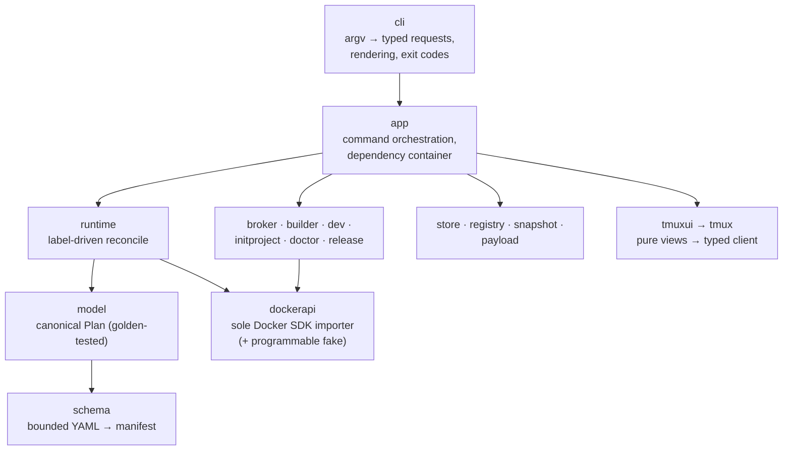

# Engine internals

Contributor reference for the Go engine: package shape, load-bearing
formats, orderings, and the testing bar. The system-level view lives in
[architecture.md](architecture.md); agent-facing rules and invariants in
[../AGENTS.md](../AGENTS.md). This is the as-built successor to the
pre-implementation design (`go-engine-design.md`, retired to git
history — all eight of its implementation slices are in the tree).

## Design rules

- `cmd/vibe` is wiring only; business logic lives under `internal/` with
  strictly inward dependencies.
- Every operation receives `context.Context`; long operations honor
  cancellation and emit structured progress.
- Paths enter the core as typed absolute paths from the `paths` and
  store resolvers; core packages never repeatedly clean arbitrary strings.
- Persistent records are versioned JSON with deterministic encoding
  (sorted fields, one trailing newline), decoded with
  `DisallowUnknownFields`, dispatched by `format`.
- Immutable objects are addressed by SHA-256 digest; display versions and
  project names are metadata, never identity.
- Writes use staging + fsync + atomic rename. Mutable records use
  compare-and-swap revisions under a project lock.
- External processes go through `runner.Runner`; Docker goes through
  `dockerapi.Client`; everything external is behind a fakeable interface.
- Dependencies are injected via `app.Dependencies`: no package globals,
  `init` side effects, or ambient environment reads in core packages.
- User-facing text is produced only by `cli`, `terminal`, and `tmuxui`;
  app and domain packages return typed results.
- Standard library first; each of the few direct dependencies needs a
  reason the stdlib can't answer.

## Package map



Shared leaves usable from anywhere: `domain` (digests, IDs, platforms,
sentinel errors — depends on nothing), `envfile` (literal dotenv),
`lock` (advisory flocks), `paths` (`~/.vibe` layout + project
discovery), `runner` (fixed-environment argv subprocesses), `terminal`
(untrusted-text encoding, prompts), `version` (build metadata).

Knowledge boundaries: `schema` knows YAML, never Docker. `model` knows
runtime semantics, never SDK types. `dockerapi` performs the one
translation from engine types to SDK requests and is the **only** package
allowed to import Docker SDK packages. `tmuxui` renderers are pure
functions over view models — no Docker, registry, or tmux calls inside a
render.

## Domain types and exit codes

`domain` provides `Digest`, `ProjectID`, `CandidateID`, `RequestID`
(constructors validate representation once) and the sentinel errors
`ErrNotFound / ErrConflict / ErrInvalid / ErrUnavailable /
ErrNotSupported / ErrCanceled`. Wrap sentinels with `%w`; the CLI maps
error classes to stable exit codes:

```text
0 success            4 project/artifact not registered
1 operation failed   5 conflict or concurrent change
2 command usage      6 external dependency unavailable
3 invalid config     130 interrupted
```

## Load-bearing formats

Anything feeding a digest is a compatibility surface; bump the relevant
format number when its serialized meaning changes.

- **Merkle tree digest** (`store.DigestTree`): one line per entry,
  `type NUL mode NUL size NUL relative-path NUL content-digest LF`,
  slash-separated paths on every platform, sorted — deterministic across
  Linux and macOS for identical content and modes.
- **Canonical plan** (`model.CanonicalJSON`): deterministic field order,
  sorted slices, normalized mounts/ports/env; `CanonicalHash` computed
  with the hash field cleared. Golden-tested — after intended plan
  changes run `go test ./internal/model -run TestCompileGolden -update`
  and review the diff.
- **Persistent records**: artifact records (digest, version, platform,
  binary/payload digests, provenance), candidate records (project, kind,
  snapshot/plan digests, resolved images), registry records (root
  identity, artifact pin, approved candidate, CAS `revision`). All
  versioned JSON as above.
- **Docker labels** on every managed object:

  ```text
  dev.vibe.managed=true
  dev.vibe.project=<project-id>
  dev.vibe.candidate=sha256:<digest>
  dev.vibe.artifact=sha256:<digest>
  dev.vibe.role=dev|sidecar:<name>
  ```

- **Schema limits** (manifest parser): ≤256 KiB default / 1 MiB ceiling,
  one document, depth ≤32, ≤10,000 nodes, ≤1,000 entries per collection,
  ≤64 KiB per scalar; aliases, anchors, merge keys, custom tags,
  duplicate keys, non-string keys, NUL, and control characters rejected.

## Candidate preparation and reconcile

Candidate creation is one pipeline shared by `up`, `rebuild`, and broker
requests: snapshot manifest + env file + imports → load/validate the
manifest *from the snapshot* → resolve image references to digests →
assemble the extension candidate when enabled → compile and validate the
plan → publish under the candidate digest → return a leased candidate.
No later stage rereads workspace paths.

Reconcile order (`runtime`): project lock → lease artifact and candidate
→ resolve/pull images → ensure volumes and network → build extension if
present → compare existing objects by label and normalized spec →
replace changed containers in dependency order → start sidecars, then
the dev container → run lifecycle hooks (post-create marker-guarded on
every reconcile, post-start only after an actual create or start; only
when the payload is mounted and carries `lifecycle.sh`) → update the
approved-candidate revision → release leases and lock. Rollback removes
only objects the failed transaction created; reconciliation never
removes a container it did not decide to replace, and refuses
name-colliding containers lacking `dev.vibe.managed`.

Garbage collection is app-orchestrated (`app.GC` gathers roots:
registry pins, approved candidates, pending broker bindings, the
newest release artifact, and their snapshots) over store primitives
(`ListObjects` / `ObjectStat` / `RemoveObject` / `CleanStaging`).
`RemoveObject` takes the object's exclusive flock non-blocking — any
live shared lease defeats it — then leaves the published path in one
rename before deleting. GC holds the store-global lock; an age floor
shields in-flight publishes that are not yet referenced.

## Concurrency

Lock order is fixed — never acquire an earlier lock while holding a
later one:

```text
store-global → artifact/candidate → project
```

Mutable records move only *after* the durable object they reference
exists and its containers run. Read-only status and rendering use shared
leases and proceed concurrently; lifecycle mutations serialize per
project.

## Testing strategy

- **Unit**: table tests per package, failure and cancellation paths
  included. Layouts via `paths.NewLayout` under `t.TempDir()` — never
  the real `~/.vibe`.
- **Fakes over mocks**: `dockerapi/fake` is programmable and records
  requests; tests assert **full request equality**, not selected fields.
  Same pattern for runner, tmux, and release sources.
- **Golden**: `model` canonical JSON; `tmuxui` views at multiple widths.
- **Integration**: `internal/dockerapi` `TestSDKLifecycle` runs against
  a real daemon and self-skips without one — never convert that skip to
  a failure or mock around it; it is the only place SDK translation
  meets a real daemon. CI runs it on push.
- **Fuzz**: native fuzz targets cover the hostile-input surfaces —
  schema load (`FuzzLoad`), envfile (`FuzzParse`), digest/ID parsers
  (`FuzzParsers`), broker request JSON (`FuzzParseRequest`), and the
  terminal encoder and diff (`FuzzEncode`/`FuzzDiff`). Seeds run in
  every `go test`; CI adds short live bursts. Found crashers are saved
  under `testdata/fuzz/` and committed as permanent regression seeds.
- **CI** (`.github/workflows/ci.yml`): gofmt, vet, build, test,
  golangci-lint, payload-manifest drift (`go generate
  ./internal/payload` must be clean), ShellCheck on the container
  payload, the three-platform cross-compile matrix with
  `CGO_ENABLED=0`, and the fuzz-burst job.
- **Owed** (tracked in [../ROADMAP.md](../ROADMAP.md)): real-daemon CI
  for the tools/extension/dev build paths.

New commands follow one shape: a typed request struct parsed in
`internal/cli` (`commands_*.go` groups, one merge point in
`commands.go`), an `app.App` method returning a typed result, and a
renderer in `output.go` deriving human and `--json` output from the same
model.

## Dependencies

Direct dependencies are pinned and deliberate: `gopkg.in/yaml.v3` (node
parsing; archived upstream — a swap candidate, not a pattern to extend),
the Docker SDK (client + API types, imported only by `dockerapi`),
`golang.org/x/sys` (openat2/flock/terminal), `golang.org/x/term`.
Provenance verification may add a minimal Sigstore set when that
milestone lands. All three release targets (`linux-amd64`,
`linux-arm64`, `darwin-arm64`) must always compile with `CGO_ENABLED=0`.

## Definition of done for a component

- Public types and interfaces match an actual caller.
- Domain behavior has unit tests, including failure and cancellation.
- Persistent output is deterministic and versioned.
- Filesystem mutations are atomic and recoverable.
- External calls sit behind a fakeable interface.
- Human and `--json` output derive from the same result model.
- All three release targets compile; fmt/vet/lint/tests pass.
- Command-level documentation updated with the implementation.
